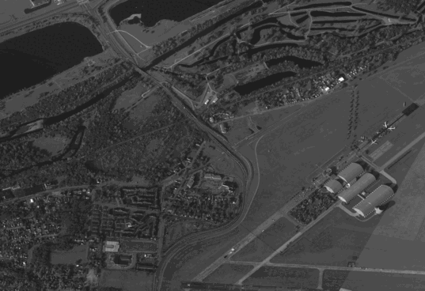

# Python Stabilizer for Satellite Videos

This code was used to produce the object tracking results shown in:

> C. Aguilar, M. Ortner and J. Zerubia, "Adaptive Birth for the GLMB Filter for object tracking in satellite videos," 2022 IEEE 32st International Workshop on Machine Learning for Signal Processing (MLSP), 2022, pp. 1-6, doi: "

If you use this code, we strongly suggest you check our object tracking paper at:

    @inproceedings{aguilar2022,
        author = {Aguilar, Camilo and Ortner, Mathias and Zerubia, Josiane},
        title = {Adaptive Birth for the GLMB Filter for object tracking in satellite videos},
        booktitle = {2022 IEEE 32nd International Workshop on Machine Learning for Signal Processing (MLSP)},
        pages={1-6},
        doi={},
        Year = {2022}
    }

  |Original data | Stabilized cropped sample |
  |:--:| :--:|
  |  | |

### Contents
1. [Installation](#installation)
2. [Usage](#usage)

### Installation

1. Clone the repository
  ```Shell
  git clone --recursive https://github.com/Ayana-Inria/satellite-video-stabilization
  ```

2. Required Libraries

```Shell
- numpy=1.22
- opencv=4.5
```

### Usage

1. Download the WPAFB 2009 dataset from the [AFRL's Sensor Data Management System (SDMS) website](https://www.sdms.afrl.af.mil/index.php?collection=wpafb2009)

2. Use the '***convert_to_png.m***' matlab script to convert the files from .ntf to .png

3. Save the images under the format and name:

```
[root for stabilize.py]
└──r0
    └── train_all/
        ├── frame_000100.png
        ├── frame_000101.png
        ├── frame_000102.png
        └── ...
```

4. Run stabilize.py
```
python stabilize.py
```


### Aknowledgment
    Thanks to BPI France (LiChiE contract) for funding this research work, and to the OPAL infrastructure from Université Côte d'Azur for providing computational resources and support.

### License
    GLMB with adaptive birth is released under the GNUv3 License (refer to the LICENSE file for details).
